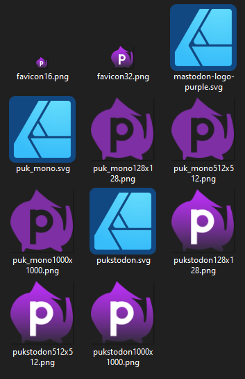

# Alexis Eva Layout & Asset Apecialist Portfolio

[About](#alexis-eva-layout--asset-apecialist-portfolio) • [Printed and Digital TTRPG](#printed-and-digital-ttrpg-blades-of-ether) • [Work to Specification](#work-to-specification) • [Remixes and Imitations](#remixes-and-imitations) • [High-Resolution Remakes](#high-resolution-remakes)

I'm alexis! between travelling the country to run, commentate, and provide A/V for massive livestream charity events, putting together local social groups and developing careers in installation A/V and DevOps Engineering, I've nursed a hobby in photo edits, imitation, and desktop and print publishing for over 10 years. If you need it matched, to-spec, or print-ready, I'm your girl!

My experience in community moderation and event management makes me the perfect pick to work with and reach out to artists and designers, and my background in programming means I'm ready to take advantage of everything from simple python organizational scripts to sprawling cloud infrastructures. Having built my skills as a hobbyist, my passion and attention to detail are second-to-none. I'll match the specification to the letter and pour over every pixel along the way. Of course, I also know when enough's enough, having had to make edits and adjustments on the clock during livestreamed events. Here's some samples of my work!

## Printed and Digital TTRPG: Blades of Ether

I was part of the development team for the tabletop roleplaying game "Blades of Ether" over the course of about two years. In addition to all the shared writing and design work, I did the entirety of the desktop publishing and layout design, created the character sheets, and coordinated with the artists we hired to create the cover art and logo. I also found and worked with the local print publisher to do a limited run of print copies. The digital PDF is fully bookmarked with interactable links, and the project of course required a bevvy of assets for its webpage on itch.io, not to mention PDF variants, downloadables, and version updates. As a highlight of creativity on a limited budget, you'll note that the inside page backgrounds use texture elements from the cover art's source material!

[Learn about Blades of Ether here.](https://witchs-hex.itch.io/blades-of-ether)

 

    

        
    

    

        
    

    

        
    

    

        
    

 

## work to specification

If given a specification or work set, I'll match it to the letter. Here's two examples, an asset set for a Mastodon instance, and a fictional ID card that's ready to print.

 

    

        
    

    

        
    

    

        
    

 

## remixes and imitations

over the years, i've edited, remixed, and remade countless images and assets. I thrive on high-resolution and vector assets and the chance to explore details down to the pixel.

 

    

        
    

    

        
    

 

A custom app icon for Fate/Grand Order, made to iOS spec, featuring my favorite character.

[Power Up With Pride](https://powerupwithpride.org) is a livestreamed Twitch charity marathon I co-founded and ran for many years that's raised over $100,000 for the Trevor Project! When working for small events, you aren't always given the assets you need. Here, I combined individual samples of purchasable t-shirts into a stylish information block, complete with links, logos, and purchase information that both matches the shirt brand's image and event's own assets.

## High-Resolution Remakes

A particular passion of mine is remaking assets from works I enjoy in high resolution and making them editable. With these, I can present my own characters just like the official media and share with fan communities in style!

 

    

        
    

    

        
    

 

The character card from Xenoblade Chronicles X, remade from scratch using the original font and all-vector layout assets.

 

    

        
    

    

        
    

    

        
    

    

        
    

    

        
    

    

        
    

 
Samples from a large, ongoing project of mine - a complete remake of a Fate/Grand Order character's stats and profile page. The page is fully customizable, letting me spec out original combat ideas and character designs. This project is incomplete - if you can spot any of the small inconsistencies in these samples I haven't fixed yet, you're exactly the kind of person I love working with!

[About](#alexis-eva-layout--asset-apecialist-portfolio) • [Printed and Digital TTRPG](#printed-and-digital-ttrpg-blades-of-ether) • [Work to Specification](#work-to-specification) • [Remixes and Imitations](#remixes-and-imitations) • [High-Resolution Remakes](#high-resolution-remakes)